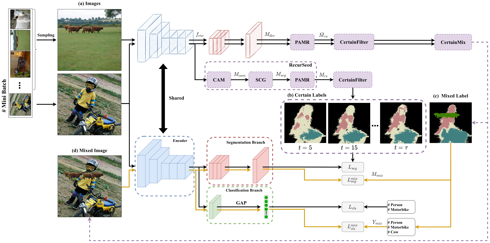

[](https://paperswithcode.com/sota/weakly-supervised-semantic-segmentation-on-1?p=recurseed-and-certainmix-for-weakly)
[](https://paperswithcode.com/sota/weakly-supervised-semantic-segmentation-on?p=recurseed-and-certainmix-for-weakly)
[](https://paperswithcode.com/sota/weakly-supervised-semantic-segmentation-on-4?p=recurseed-and-certainmix-for-weakly)

# RecurSeed and EdgePredictMix
This repository is the official implementation of "RecurSeed and EdgePredictMix: Single-stage learning is sufficient for Weakly-Supervised Semantic Segmentation". Please feel free to reach out for any questions or discussions.

# Citation
- Please cite our paper if the code is helpful to your research. [arxiv](https://arxiv.org/abs/2204.06754)
```
@article{jo2022recurseed,
  title={RecurSeed and EdgePredictMix: Single-stage Learning is Sufficient for Weakly-Supervised Semantic Segmentation},
  author={Jo, Sanghyun and Yu, In-Jae and Kim, Kyungsu},
  journal={arXiv preprint arXiv:2204.06754},
  year={2022}
}
```

### Abstract
Although weakly-supervised semantic segmentation using only image-level labels (WSSS-IL) is potentially useful, its low performance and implementation complexity still limit its application. The main causes are (a) non-detection and (b) false-detection phenomena: (a) The class activation maps refined from existing WSSS-IL methods still only represent partial regions for large-scale objects, and (b) for small-scale objects, over-activation causes them to deviate from the object edges. We propose RecurSeed which alternately reduces non- and false detections through recursive iterations, thereby implicitly finding an optimal junction that minimizes both errors. We also propose a novel data augmentation (DA) approach called EdgePredictMix, which further expresses an object's edge by utilizing the probability difference information between adjacent pixels in combining the segmentation results, thereby compensating for the shortcomings when applying the existing DA methods to WSSS. We achieved new state-of-the-art performances on both the PASCAL VOC 2012 and MS COCO 2014 benchmarks (VOC \emph{val} $74.4\%$, COCO \emph{val} $46.4\%$).



# Update

[04/14/2022] Released "RecurSeed and CertainMix" for testing.

[08/19/2022] Released "RecurSeed and EdgePredictMix" for testing.

# Setup

Setting up for this project involves installing dependencies and preparing datasets. The code is tested on Ubuntu 20.04 with NVIDIA GPUs and CUDA installed. 

### Installing dependencies
To install all dependencies, please run the following:
```bash
python3 -m pip install git+https://github.com/lucasb-eyer/pydensecrf.git
python3 -m pip install -r requirements.txt
```

### Preparing datasets

Please download following VOC and COCO datasets. Each dataset has a different directory structure. Therefore, we modify directory structures of all datasets for a comfortable implementation. 

> ##### 1. PASCAL VOC 2012
> Download PASCAL VOC 2012 dataset from our [[Google Drive](https://drive.google.com/file/d/1dkwHjd-r4Xe4ap0PWNMn0GRnekIrEKyQ/view?usp=sharing)].

> ##### 2. MS COCO 2014
> Download MS COCO 2014 dataset from our [[Google Drive](https://drive.google.com/file/d/1Nn2zsJg3L52xYo40s3nx_EeUNAa4RULf/view)].

Create a directory "../VOC2012/" for storing the dataset and appropriately place each dataset to have the following directory structure.
```
    ../                               # parent directory
    ├── ./                            # current (project) directory
    │   ├── core/                     # (dir.) implementation of RecurSeed and CertainMix
    │   ├── data/                     # (dir.) information per dataset (including class names and the number of classes)
    │   ├── tools/                    # (dir.) helper functions
    │   ├── README.md                 # intstruction for a reproduction
    │   └── ... some python files ...
    |
    ├── VOC2012/                      # PASCAL VOC 2012
    │   ├── train/              
    │   │   ├── image/     
    │   │   ├── mask/        
    │   │   └── xml/        
    │   ├── train_aug/
    │   │   ├── image/     
    │   │   ├── mask/        
    │   │   └── xml/   
    │   ├── validation/
    │   │   ├── image/     
    │   │   ├── mask/        
    │   │   └── xml/   
    │   └── test/
    │       └── image/
    |
    └── COCO2014/                     # MS COCO 2014
        ├── train/              
        │   ├── image/     
        │   ├── mask/        
        │   └── xml/
        └── validation/
            ├── image/     
            ├── mask/        
            └── xml/
```

# Visualization
We prepared [a jupyter notebook](https://github.com/OFRIN/RecurSeed_and_EdgePredictMix/blob/master/demo.ipynb) for visualization.

# Training
The whole code and commands are under review and will release soon.

# Evaluation

Release our weights and official results (anonymous link).

| Stage | Backbone | Pretrained weight            | VOC val | VOC test |
|:-----:|:------------:|:----------------------------:|:-------:|:--------:|
| single-stage | ResNet-50 | [weight](https://drive.google.com/file/d/17wcdksR3qdBNzVRIWBg4xC_3FgcLryht/view) | [link](http://host.robots.ox.ac.uk:8080/anonymous/LKO4IS.html) | [link](http://host.robots.ox.ac.uk:8080/anonymous/9MLLHH.html) |
| multi-stage | ResNet-101 | [weight](https://drive.google.com/file/d/1w8GjZKc8tNFMOWqSEHumgdI9twXfq0ka/view?usp=sharing) | [link](http://host.robots.ox.ac.uk:8080/anonymous/SNDUAQ.html) | [link](http://host.robots.ox.ac.uk:8080/anonymous/HUHADT.html) |

Below lines are testing commands to reproduce our method.

### 1. Single-stage Results
```bash
# Generate initial seeds produced from our single-stage method.
python3 infer_rsepm.py \
--gpus 2 --root_dir ../VOC2012/ --dataset VOC --domain validation \
--backbone resnet50 --tag "ResNet50@VOC@RS+EPM@Official" --conf_th 0.34

# Convert initial seeds to predicted masks with CRF.
python3 convert_seed_to_pseudo_masks.py \
--gpus 0 --root_dir ../VOC2012/ --dataset VOC --domain validation \
--folder predictions --tag "ResNet50@VOC@RS+EPM@Official" 

# Calculate the mIoU.
# [validation] http://host.robots.ox.ac.uk:8080/anonymous/LKO4IS.html
# [test] http://host.robots.ox.ac.uk:8080/anonymous/9MLLHH.html
python3 evaluate.py \
--root_dir ../VOC2012/ --domain validation \
--folder pseudo-labels --tag "ResNet50@VOC@RS+EPM@Official"
```

### 2. Multi-stage Results
```bash
# Generate initial seeds produced from final segmentation model.
python3 infer_seg.py \
--gpus 3 --root_dir ../VOC2012/ --dataset VOC --domain validation \
--backbone resnet101 --decoder deeplabv3+ \
--tag "ResNet101@VOC@RS+EPM@MS@Official"

# Convert initial seeds to predicted masks with CRF.
python3 convert_seed_to_pseudo_masks.py \
--gpus 0 --root_dir ../VOC2012/ --dataset VOC --domain validation \
--folder predictions --tag "ResNet101@VOC@RS+EPM@MS@Official"

# Calculate the mIoU.
# [validation] http://host.robots.ox.ac.uk:8080/anonymous/SNDUAQ.html
# [test] http://host.robots.ox.ac.uk:8080/anonymous/HUHADT.html
python3 evaluate.py \
--root_dir ../VOC2012/ --domain validation \
--folder pseudo-labels --tag "ResNet101@VOC@RS+EPM@MS@Official"
```
